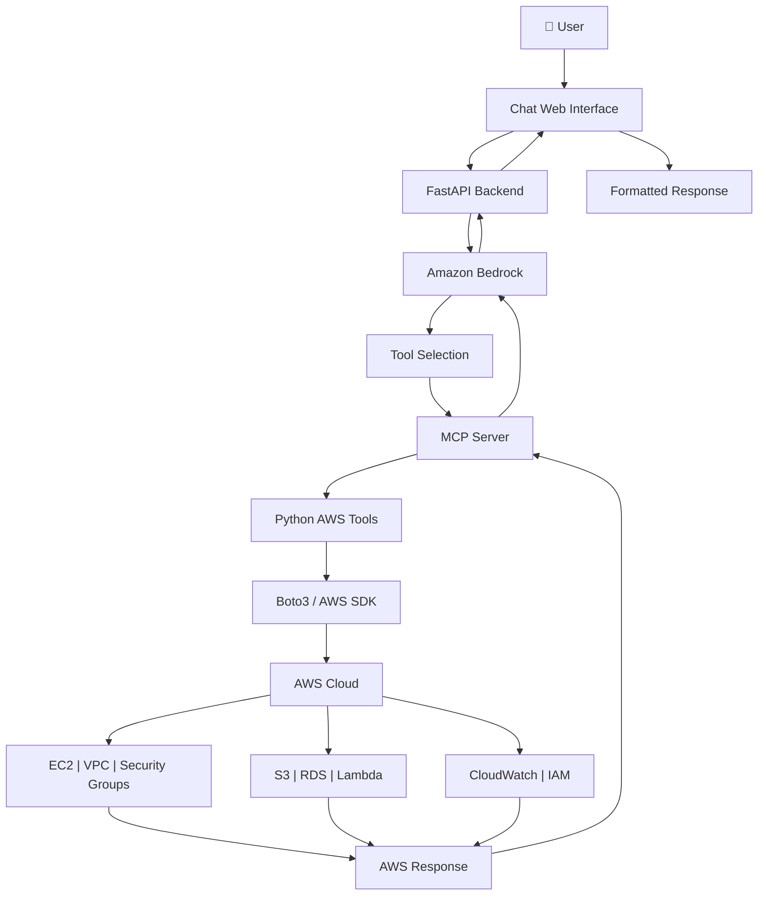

# ☁️ CloudPilot AI
### AI-Powered AWS Infrastructure Management Assistant

<p align="center">
  <strong>Your AWS Cloud. One Chat. AI-Powered Control.</strong>
</p>

<p align="center">
  
  
  
  
  
</p>

---

## 🚀 Overview

**CloudPilot AI** is an AI-powered AWS management assistant designed to simplify cloud infrastructure operations through natural-language conversations.

Instead of manually navigating multiple AWS services and consoles, users can interact with CloudPilot AI using a chat-based interface.

Powered by **Amazon Bedrock, Python, FastAPI, MCP, and Boto3**, the assistant interprets user requests, selects appropriate tools, interacts with AWS APIs, and returns structured responses.

The project explores how Generative AI and Model Context Protocol (MCP) can be combined to build an intelligent cloud operations assistant.

## 🎯 Project Objectives

- Simplify AWS infrastructure management through conversational AI.
- Integrate Amazon Bedrock with AWS service tools.
- Enable structured AWS resource inspection.
- Automate selected cloud operations through controlled execution.
- Implement approval workflows for sensitive infrastructure changes.
- Explore AI-driven cloud operations and infrastructure automation.

---

## 🏗️ Architecture



### Architecture Components

| Component | Responsibility |
|---|---|
| Chat UI | Accept natural-language user requests |
| FastAPI | Backend API and request handling |
| Amazon Bedrock | Understand prompts and select tools |
| MCP Server | Expose structured tools to the AI |
| Boto3 | Communicate with AWS APIs |
| IAM Role | Control AWS permissions |
| AWS Services | Infrastructure resources and operations |

---

## ✨ Key Features

### 💬 Conversational AWS Interaction
Interact with AWS infrastructure using natural-language prompts.

Example:

```text
Show me all EC2 instances in Mumbai region.
```

### 🤖 AI-Powered Tool Calling
Amazon Bedrock interprets requests and selects the appropriate available tool.

### ☁️ AWS Resource Inspection
Inspect supported AWS resources and retrieve infrastructure information.

### 🔍 Security Group Auditing
Identify potentially risky security group configurations, including:

- Public access to all protocols
- Broad TCP port ranges
- Public SSH access
- Public database ports

### ⚙️ Controlled Infrastructure Operations
Selected write operations can be designed with explicit user approval before execution.

### 🔐 IAM-Based Access Control
AWS operations are performed using configured AWS credentials or IAM roles rather than hardcoded access keys.

---

## 🛠️ Technology Stack

| Category | Technologies |
|---|---|
| Programming Language | Python 3.11+ |
| AI Model | Amazon Bedrock |
| Backend | FastAPI |
| AI Tool Integration | Model Context Protocol (MCP) |
| AWS SDK | Boto3 |
| Cloud Platform | Amazon Web Services |
| Frontend | HTML, CSS, JavaScript |
| Deployment | AWS EC2 |
| Authentication | AWS IAM Role / Credentials |

---

## 🔄 How It Works

1. User enters a request in the chat interface.
2. Frontend sends the request to FastAPI.
3. Backend forwards the prompt and available tool definitions to Amazon Bedrock.
4. Bedrock determines whether an AWS tool is required.
5. MCP exposes the selected tool to the backend.
6. Python executes the corresponding AWS operation using Boto3.
7. AWS returns resource information or operation status.
8. CloudPilot AI formats the result and displays it in the chat interface.

---

## 📂 Project Structure

```text
cloudpilot-ai-aws-services/
│
├── app/
│   ├── server.py
│   ├── agent_client.py
│   └── web.py
│
├── static/
│   └── index.html
│
├── requirements.txt
├── README.md
└── .gitignore
```

*The structure above represents the application layout; adjust filenames if your repository differs.*

---

## ⚙️ Installation & Setup

### Prerequisites

- Python 3.11+
- AWS Account
- AWS CLI
- Configured IAM Role or AWS credentials
- Amazon Bedrock model access
- Git

### 1. Clone Repository

```bash
git clone https://github.com/devkunaljadhav/cloudpilot-ai-aws-services.git

cd cloudpilot-ai-aws-services
```

### 2. Create Virtual Environment

```bash
python3.11 -m venv venv311

source venv311/bin/activate
```

### 3. Install Dependencies

```bash
pip install -r requirements.txt
```

### 4. Configure AWS Region

```bash
export AWS_DEFAULT_REGION=ap-south-1
```

### 5. Verify AWS Identity

```bash
aws sts get-caller-identity
```

Ensure that the configured IAM identity has the required permissions.

### 6. Start the Application

Run the appropriate application entry point configured in your repository.

For the FastAPI web application, if `app/web.py` exposes the `app` object:

```bash
uvicorn app.web:app --host 127.0.0.1 --port 8000
```

Open:

```text
http://127.0.0.1:8000
```

For remote EC2 deployment, use an SSH tunnel rather than exposing the development server publicly.

---

## 🔐 Security Considerations

CloudPilot AI is designed around controlled AWS access.

- Use IAM roles and least-privilege policies.
- Avoid hardcoding AWS access keys.
- Require explicit approval for sensitive write operations.
- Validate tool parameters before execution.
- Avoid unrestricted infrastructure permissions.
- Never expose development endpoints directly to the public internet.
- Review AWS costs before enabling resource creation.

**Important:** Actual capabilities depend on the tools implemented and the IAM permissions assigned to the execution identity.

---

## 🧪 Example Prompts

```text
List all EC2 instances.

Show available VPCs.

List security groups.

Inspect a security group.

Audit a security group for risky inbound rules.

Explain the current AWS infrastructure.
```

Supported prompts depend on the tools enabled in the current implementation.

---

## 🗺️ Roadmap

- [x] AWS SDK integration
- [x] Amazon Bedrock integration
- [x] MCP tool integration
- [x] EC2, VPC and Security Group inspection
- [x] Basic Security Group auditing
- [x] FastAPI web interface
- [ ] Improved ChatGPT-style user experience
- [ ] Expanded AWS service integrations
- [ ] Approval-based infrastructure provisioning
- [ ] Execution history and audit logs
- [ ] Authentication and multi-user support
- [ ] Docker-based deployment
- [ ] Advanced AI-powered infrastructure analysis

---

## 📸 Screenshots

Add your actual application screenshots here.

```markdown

```

## 🎓 Learning Outcomes

Through this project, I am exploring:

- Generative AI integration with AWS
- Amazon Bedrock tool use
- Model Context Protocol (MCP)
- Python-based cloud automation
- AWS SDK and IAM permissions
- FastAPI backend development
- Cloud security and controlled infrastructure operations
- AI-driven DevOps workflows

---

## 👨‍💻 Author

**Kunal Prakash Jadhav**

B.Sc. Computer Science | Cloud & DevOps Enthusiast

- GitHub: [@devkunaljadhav](https://github.com/devkunaljadhav)
- LinkedIn: [Connect with me](https://linkedin.com/in/devkunaljadhav)

---

## ⭐ Support

If you find this project interesting, consider giving the repository a ⭐ star.

Contributions, suggestions, and feedback are welcome!

---

<p align="center">
  <strong>CloudPilot AI — Making AWS Operations Conversational.</strong>
</p>
